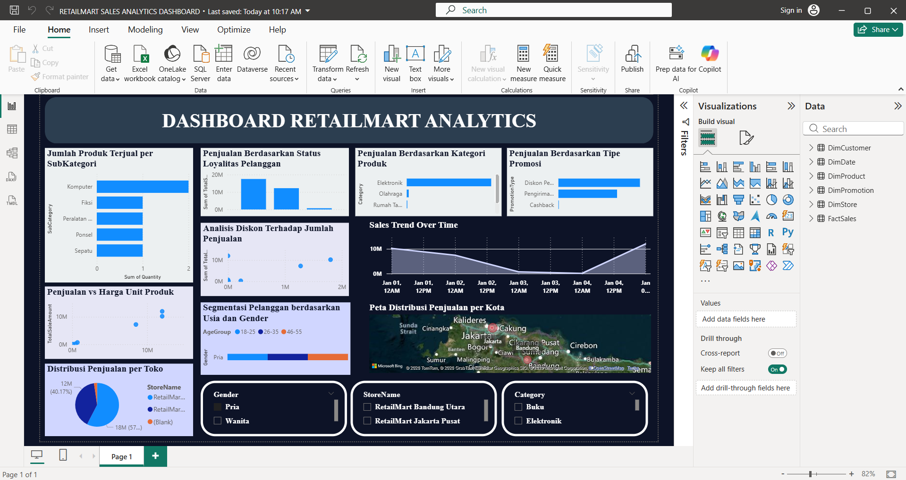

# Retail Sales Analytics Dashboard – Power BI

This project is a **data analytics dashboard** built using Power BI to analyze retail sales performance across products, customers, stores, and promotions.

Developed as part of my academic learning, this project demonstrates the application of business intelligence concepts and data visualization techniques.

---

## Project Objective

* Analyze retail sales performance
* Identify sales trends and patterns over time
* Understand customer segmentation and behavior
* Provide insights for business decision-making

---

## Features

* Sales overview and key metrics
* Sales trend over time
* Product performance by category & subcategory
* Promotion impact on sales
* Customer segmentation (age & gender)
* Sales distribution by store
* Geographic sales distribution
* Interactive filters (Gender, Store, Category)

---

## Dashboard Preview

---

## Tech Stack

* **Tool**: Microsoft Power BI
* **Data Modeling**: Star Schema (Fact & Dimension Tables)
* **Data Source**: Simulated / academic dataset

---

## Data Structure

* **Fact Table**: FactSales
* **Dimension Tables**:

  * DimCustomer
  * DimProduct
  * DimStore
  * DimDate
  * DimPromotion

---

## Key Insights

* Sales trends fluctuate over time with noticeable peaks
* Certain product categories dominate total sales
* Promotions significantly impact sales performance
* Customer segmentation reveals different buying behaviors
* Sales distribution varies across stores and locations

---

## Academic Context

This project was created as part of a university assignment to fulfill academic requirements and demonstrate understanding of:

* Data analysis
* Data visualization
* Business intelligence tools (Power BI)

---

## What I Learned

* Designing interactive dashboards in Power BI
* Applying data modeling (fact & dimension tables)
* Analyzing business data for insights
* Presenting data in a clear and meaningful way

---

## Author

**Kevin Wilmer Vittorio**
[kevinwilmerv07@gmail.com](mailto:kevinwilmerv07@gmail.com)

---

## Notes

This project is for learning and portfolio purposes and may be further improved in the future.
